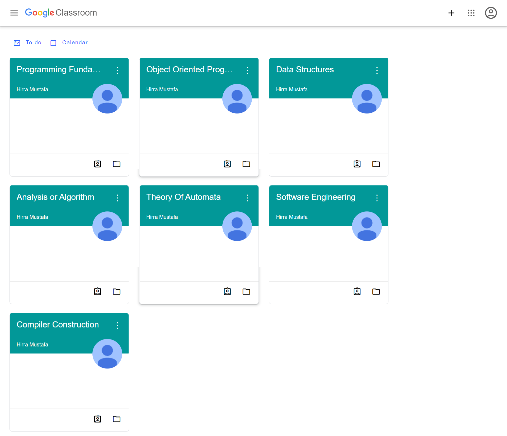
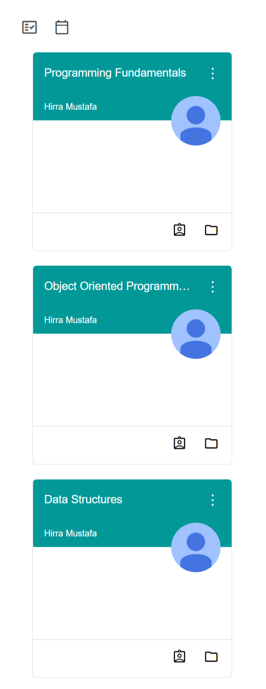

# Google Classroom

## Table of contents

- [Overview](#overview)
  - [Project](#project)
  - [Screenshot](#screenshot)
  - [Links](#links)
- [Process](#process)
  - [Built with](#built-with)
- [Author](#author)

## Overview

### Project

The project is a self-made replica of Google Classroom.

### Screenshot

### Links

- Live Site URL: [https://sumayyahsayyed.github.io/Google-Classroom/]

## Process

### Built with

- Semantic HTML5 markup
- CSS custom properties
- Flexbox

## Author

[SumayyahSayyed]
